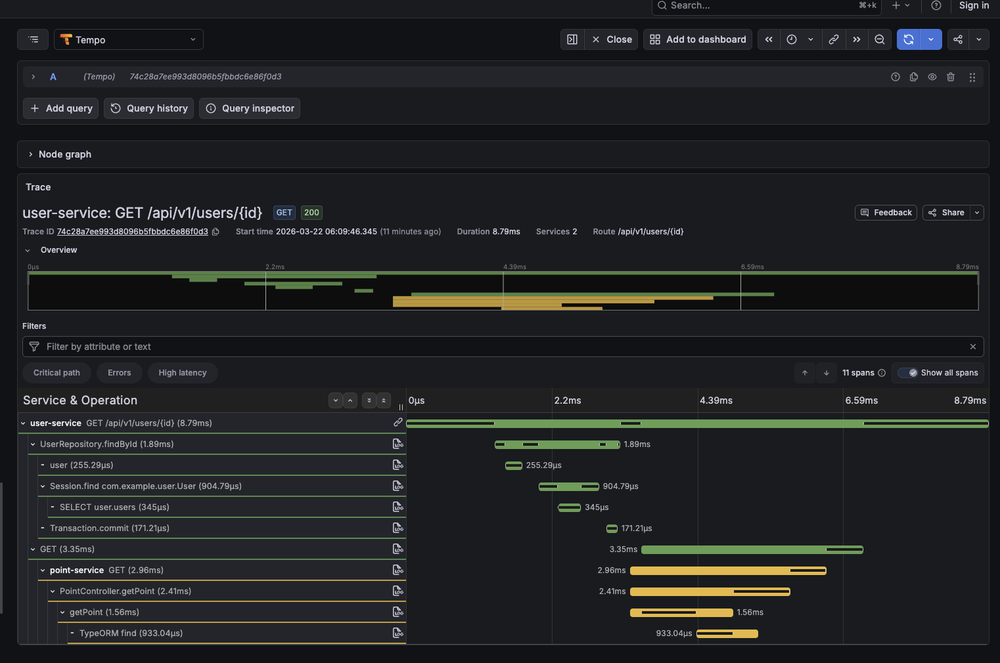
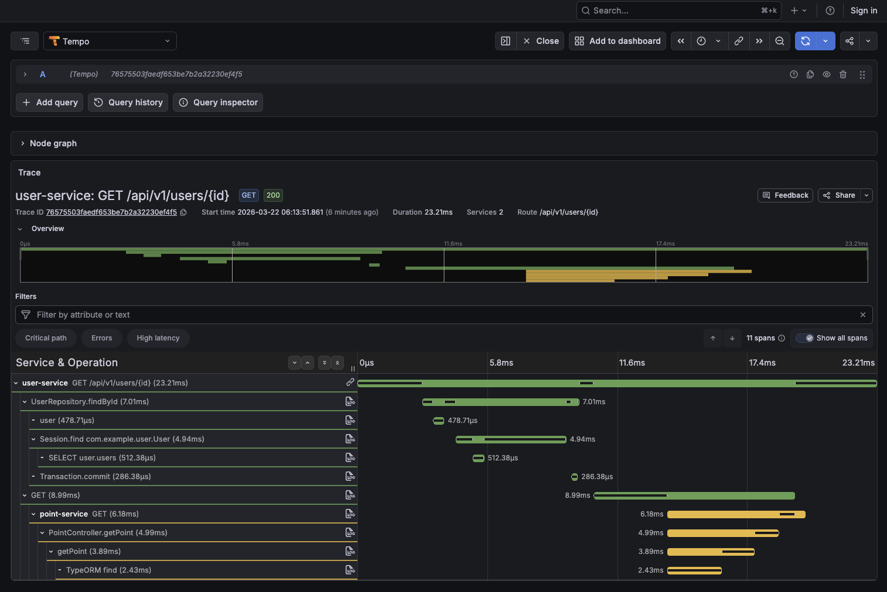

# Lab06-02: Span Profiles — Linking Traces to Profiles

## Overview

Lab นี้รวม **Distributed Tracing** (OpenTelemetry) กับ **Continuous Profiling** (Pyroscope) เข้าด้วยกันผ่าน **Span Profiles** ทำให้สามารถคลิกจาก trace span ไปดู flame graph ของ span นั้นๆ ได้โดยตรง

สิ่งที่ได้เรียนรู้:
- การ link profiles เข้ากับ traces (span-level profiling)
- การใช้ Pyroscope agent ร่วมกับ OpenTelemetry agent ใน Java
- การใช้ `otel-profiling-go` wrapper ใน Go
- การดู "Profiles for this span" ใน Grafana Tempo

## Architecture

```
┌──────────────┐   ┌──────────────┐   ┌──────────────┐
│ user-service │   │ store-service │   │ point-service│
│  (Java)      │   │  (Go)        │   │  (NestJS)    │
│  OTel agent  │   │  OTel SDK    │   │  OTel SDK    │
│  + Pyroscope │   │  + Pyroscope │   │  + Pyroscope │
│    agent     │   │    SDK       │   │    SDK       │
└──────┬───────┘   └──────┬───────┘   └──────┬───────┘
       │                  │                  │
       ├──── traces ──────┼──────────────────┤
       │                  │                  │
       └──── profiles ────┼──────────────────┘
                          │
       ┌──────────────────┼──────────────────┐
       ▼                  ▼                  ▼
┌──────────┐      ┌──────────────┐   ┌──────────────┐
│  LGTM    │      │  Pyroscope   │   │  Prometheus  │
│  :3000   │      │  :4040       │   │  :9090       │
│(Tempo)   │      │              │   │              │
└──────────┘      └──────────────┘   └──────────────┘
```

## Span Profiles — วิธีการ Link

### Java (user-service)
Pyroscope Java agent **ตรวจจับ OTel Java agent โดยอัตโนมัติ** และ link profiles เข้ากับ spans ให้เอง ไม่ต้องเขียน code เพิ่ม

```dockerfile
# ใช้ 2 agents พร้อมกัน
ENTRYPOINT ["java", "-javaagent:opentelemetry-javaagent.jar", "-javaagent:pyroscope.jar", "-jar", "app.jar"]
```

### Go (store-service)
ใช้ `otel-profiling-go` wrapper ครอบ TracerProvider:

```go
import otelpyroscope "github.com/grafana/otel-profiling-go"

// Wrap TracerProvider
otel.SetTracerProvider(otelpyroscope.NewTracerProvider(tp))
```

### Node.js (point-service)
เริ่ม Pyroscope ก่อน OTel bootstrap:

```typescript
import Pyroscope from '@pyroscope/nodejs';
Pyroscope.init({ serverAddress: '...', appName: 'point-service' });
Pyroscope.start();
```

## Getting Started

### 1. Start ทุก services

```bash
docker compose up -d --build
```

### 2. ทดสอบ services

```bash
curl http://localhost:8080/api/v1/users/1
curl http://localhost:8000/api/v1/product
curl http://localhost:8001/api/v1/point
```

### 3. สร้าง traffic

```bash
docker run --rm -i grafana/k6 run - <scripts/load.js
```

### 4. ดู Traces + Profiles ใน Grafana

1. เปิด Grafana: http://localhost:3000
2. ไปที่ **Explore** → เลือก datasource **Tempo**
3. ค้นหา trace ที่สนใจ
4. คลิกที่ span → จะเห็น **"Profiles for this span"**
5. คลิกเพื่อดู flame graph ของ span นั้น

### 5. ดู Profiles โดยตรง

1. ไปที่ **Explore** → เลือก datasource **Pyroscope**
2. เลือก application และ profile type
3. ดู flame graph ภาพรวม

## Ports

| Port | Service |
|------|---------|
| 3000 | Grafana |
| 4040 | Pyroscope |
| 8080 | user-service |
| 8000 | store-service |
| 8001 | point-service |
| 9090 | Prometheus |

## Clock Skew ใน Distributed Tracing

เมื่อดู trace ที่มีการเรียกข้าม service (เช่น user-service → point-service) อาจสังเกตเห็นว่า **span ของ child service เริ่มต้นหรือสิ้นสุดไม่ตรงกับ span ของ parent service** เช่น span ของ point-service ยาวเกินขอบ GET span ของ user-service

### ตัวอย่าง

**Trace ที่ 1** — point-service spans (สีเขียว) ยื่นออกมาเล็กน้อยเกินขอบ GET span ของ user-service:



**Trace ที่ 2** — เห็นชัดเจนกว่า point-service spans เริ่มและจบไม่ตรงกับ GET span ของ user-service:



### สาเหตุ — ไม่ใช่ปัญหา Docker time sync

ทุก container ใน Docker Compose บน macOS ใช้ **kernel clock เดียวกัน** ผ่าน Docker VM ดังนั้นนาฬิการะบบตรงกัน

สาเหตุที่แท้จริงคือ **clock skew ระหว่าง OTel SDK/agent ของแต่ละภาษา**:

| Service | ภาษา | วิธีจับ timestamp |
|---------|------|------------------|
| user-service | Java (OTel agent) | `System.nanoTime()` (monotonic) mapped to wall clock |
| point-service | Node.js (OTel SDK) | `performance.now()` หรือ `Date.now()` |

ความคลาดเคลื่อน (~1-2ms) เกิดจาก:

1. **ความแตกต่างของ timestamp precision** ระหว่าง Java และ Node.js OTel implementation
2. **Network latency** — HTTP client span ของ user-service จบเมื่อได้รับ response แต่ point-service อาจบันทึก span end หลังจากส่ง response ไปแล้วเล็กน้อย
3. **Span reporting granularity** — spans ถูก batch และ timestamps อาจมี drift ระดับ microsecond ระหว่าง runtime ที่ต่างกัน

### สรุป

นี่คือ **พฤติกรรมปกติ** ของ distributed tracing ไม่ใช่ bug แม้แต่ในระบบ production ที่ใช้ NTP sync ก็ยังเห็น child span ที่ดูเหมือนเริ่มก่อนหรือจบหลัง parent span ได้ Grafana/Tempo แสดงความสัมพันธ์ parent-child ได้ถูกต้องผ่าน **trace context propagation** (`traceparent` header) ไม่ได้ใช้ timestamp ในการจับคู่

## Stop

```bash
docker compose down
```
